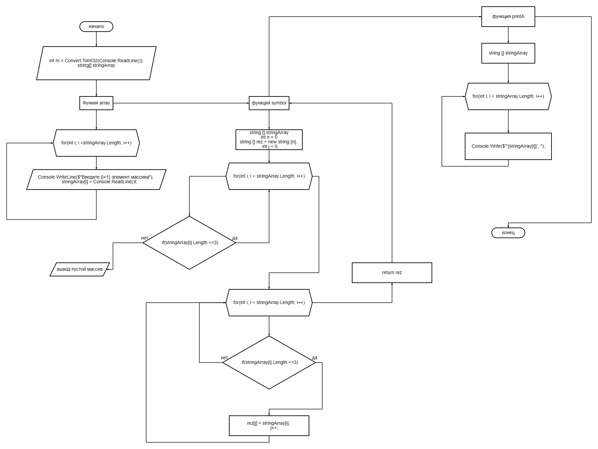
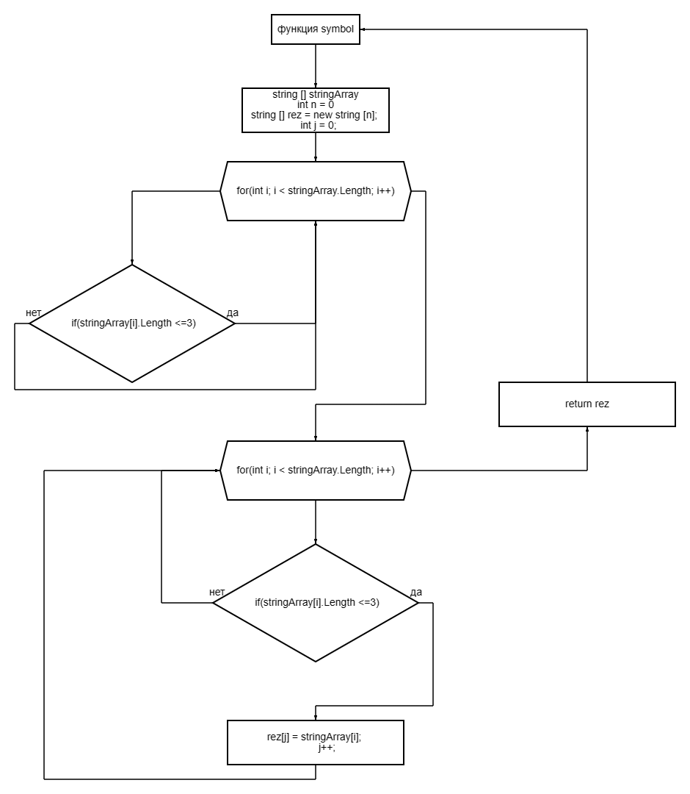

## Задача

Написать программу, которая из имеющегося массива строк формирует новый массив из строк, длина которых меньше, либо равна 3 символам. Первоначальный массив можно ввести с клавиатуры, либо задать на старте выполнения алгоритма. При решении не рекомендуется пользоваться коллекциями, лучше обойтись исключительно массивами.

## Описание алгоритма:

В консоле пользователь задает длину массива функция void array дает возможность пользователю ввести каждый элемент в зависимости какую длину ввел пользователь, такое колличество выйдет элементов. Функция symbol — вначале считает количество элементов массива с тремя и менее символами. Затем создает массив нужной размерностью и вносит данные из введенного массива в результат функции.
функция printA- выводит значения на экран
## Блок схема кода полная: 

 
## Блок схема основной блок:

 
